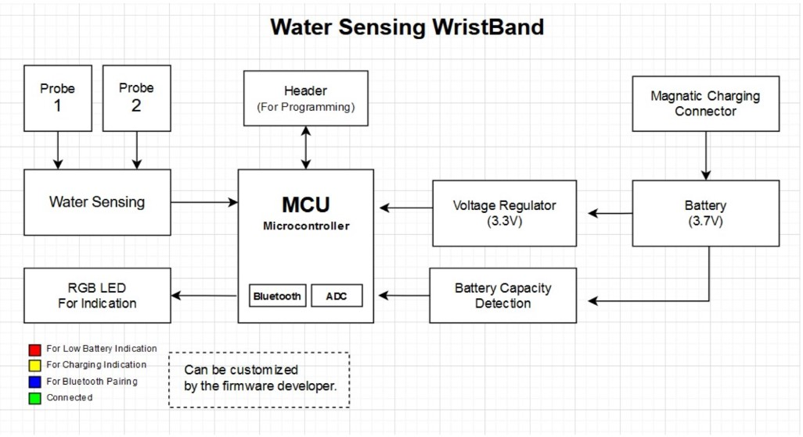

# Smart Water Sensing Band

The **Smart Water Sensing Band** is a wearable device designed to **detect water exposure** and provide **visual and wireless indications**. It uses a low-power **microcontroller with Bluetooth**, water sensing probes, and an RGB LED for status indication. The device is powered by a **3.7V rechargeable battery** with magnetic charging support.

## Water Sensing Circuit Testing Video
https://youtu.be/b6jqbITn7T8

## Key Features

* Water detection using external probes
* Bluetooth-enabled microcontroller
* RGB LED status indication
* Rechargeable Li-ion / Li-Po battery
* Magnetic charging connector
* Battery capacity monitoring via ADC
* Low-power 3.3V regulated supply

## System Description

* **Water Sensing Probes:** Detect presence of water and send signal to MCU
* **MCU:** Processes sensor input, handles Bluetooth communication, and controls LED indications
* **RGB LED:** Indicates device status (low battery, charging, pairing, connected)
* **Battery & Charging:** 3.7V battery with magnetic charging connector
* **Voltage Regulator:** Provides stable 3.3V to MCU
* **Battery Monitoring:** Battery voltage measured using MCU ADC
* **Programming Header:** Used for firmware flashing and debugging

## LED Indications (Firmware Configurable)

* 🔴 Low Battery
* 🟡 Charging
* 🔵 Bluetooth Pairing
* 🟢 Connected

